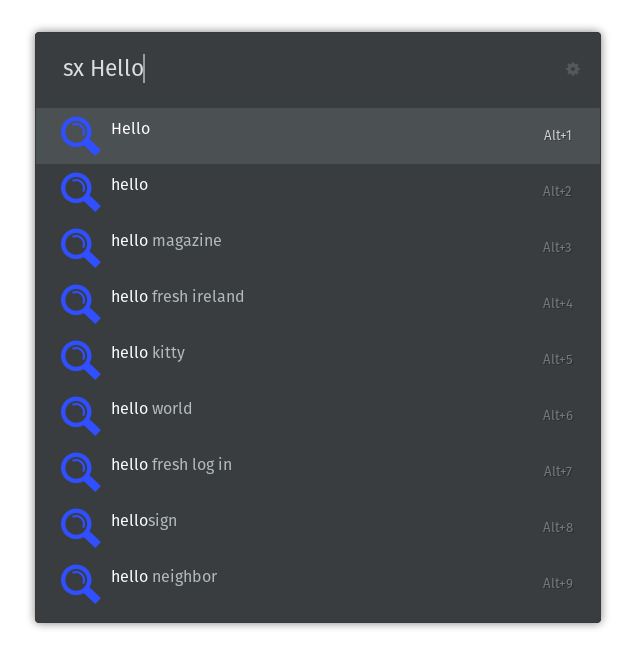

# Searx Ulauncher extension



This Ulauncher extension enables you to use the Searx engine. Modified to allow adding custom instances as well as a few other configurable options

## Install

Then open Ulauncher preferences window > extensions > add extension and paste the following url:

```
https://github.com/Greenphlem/ulauncher-searx
```

## Credits

### Original Idea:
```
https://github.com/mikebarkmin/ulauncher-duckduckgo
```
